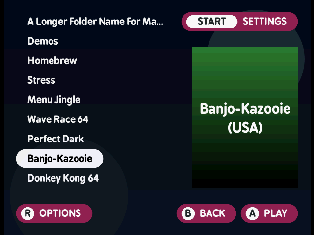
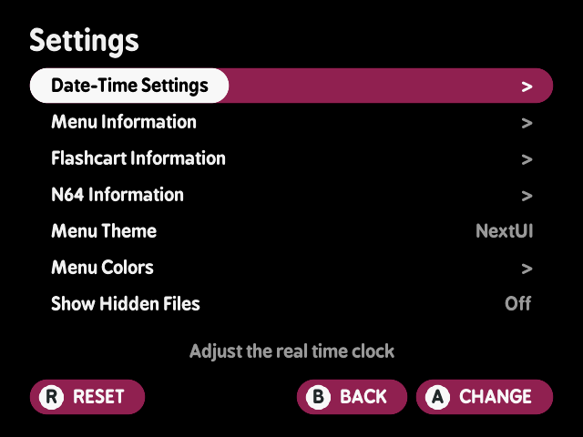
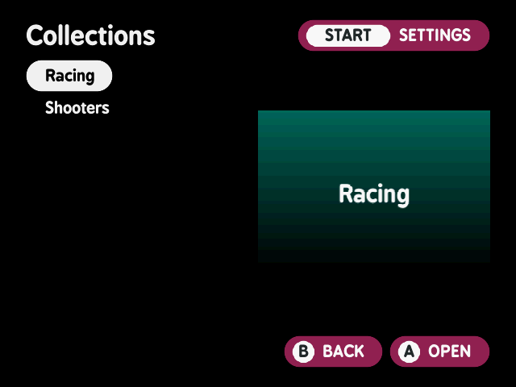
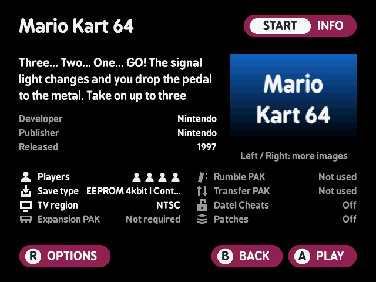

> Kept verbatim from N64FlashcartMenu's own `docs/20_nextui_theme.md`, apart from the image paths,
> which point at the screenshots beside this file rather than at upstream's `images/` directory.
> Links to other numbered documents (`16_background_images.md`, `19_gamepak_boxart.md`,
> `65_experimental.md`) resolve in the upstream docs tree, not here.
>
> The extracted spec is [`source-notes.md`](source-notes.md).

## NextUI theme

N64FlashcartMenu includes an optional theme inspired by the [NextUI](https://nextui.loveretro.games/) custom firmware: a black background, large rounded list text, a white rounded "pill" behind the selected entry, box art for the highlighted ROM on the right side of the screen, full-screen background images, and pill-style button hints.



### Enabling the theme

Open the menu settings and change **Menu Theme** to **NextUI** (with the classic look, press `Start`, choose `Menu Settings Editor`, press `A` and pick `Menu Theme`). The change takes effect immediately and is stored in `sd:/menu/config.ini`:

```ini
[menu]
theme=nextui
```

Set `theme=classic` (or remove the key) to return to the classic look.

### Colors and palettes

The theme's colors follow NextUI's seven configurable slots, defaulting to NextUI's stock look (magenta `9B2257` accent):

| Slot | Meaning |
|---|---|
| Main Color | Selection pill, button circles, progress fills |
| Primary Accent | Chrome pills, the optional title pill and the folder placeholder tint |
| Secondary Accent | Button glyph letters |
| List Text | Unselected list text |
| List Text (Selected) | Text on the selection pill |
| Hint Text | Hint pill text, screen titles and the load screen's icons |
| Background | Screen background when no image is set |

Open **Start** -> **Menu Colors** to change them. The **Palette** row picks from the palettes built into the menu (all 18 of NextUI's stock palettes, including the Catppuccin family) plus any found on the SD card; selecting a color row opens an editor where `Left`/`Right` pick the R/G/B channel, `Up`/`Down` adjust it (`C-Up`/`C-Down` in bigger steps), `A` saves and `B` cancels. Changes apply immediately, no reboot needed, and `R` in Menu Colors resets the colors and title pills to NextUI stock. Screen titles draw in the Hint Text color - NextUI's color for all text placed directly on the background - so they stay readable in every palette; the **Title Pills** row instead draws NextUI's Game Switcher title treatment, an accent-filled pill with hint-colored text, behind every screen title. Palettes can set its default (none of the built-ins do) and you can toggle it any time. The palette picker is a live preview: the whole screen re-renders in the highlighted palette as you move through the list - title, selection pill, list text, hints and the background color itself - with a strip of the palette's seven colors beside the list. `A` applies the highlighted palette; `B` restores the colors you came in with.

Custom palettes go in `sd:/menu/palettes/` as `.txt` files in NextUI's palette format, so palettes made for NextUI devices drop straight in:

```text
version=1
name=My Palette
color1=0xFFFFFFFF
color2=0x9B2257FF
color3=0x1E2329FF
color4=0xFFFFFFFF
color5=0x000000FF
color6=0xFFFFFFFF
color7=0x000000FF
```

Colors are `0xRRGGBB` or `0xRRGGBBAA` (the alpha is ignored); `name` is optional and falls back to the filename. `title_pill=1` is an optional N64FlashcartMenu extension that turns on the title pill when the palette is applied; palettes without it, including any made for NextUI devices and all of the built-ins, leave titles bare. The toggle is stored in `sd:/menu/config.ini` as `theme_title_pill`. The seven colors are also stored individually in `sd:/menu/config.ini` as `theme_color1` through `theme_color7` (RGB hex), so they can be hand-edited too; the older `theme_accent_color` key is still honored and kept in sync.

### Box art

While browsing, box art for the highlighted ROM is shown on the right side of the screen. Art is looked up in three places, in order:

1. **Pre-converted sprite (fastest)**: a `.media/<rom name>.sprite` file in libdragon's sprite format displays near-instantly, with no decoding. Convert PNGs on your computer with libdragon's `mksprite` tool, e.g. `mksprite --format RGBA16 --compress 1 -o .media artwork.png` (use `--format CI8` to halve the file size; stick to `--compress 1` or lower). This is optional; PNGs work without any conversion.

2. **Sidecar art (NextUI convention)**: a `.media` folder next to your ROMs, with a PNG named exactly after the ROM file (minus its extension):

   ```text
   sd:/games/GoldenEye 007 (USA).z64
   sd:/games/.media/GoldenEye 007 (USA).png
   ```

   This matches the layout produced by NextUI artwork scrapers. Images must be PNG files no larger than **288x288** pixels; any aspect ratio within that box works and is scaled to fit.

3. **Metadata art (existing scheme)**: if no sidecar art exists, the menu reads the ROM's header and falls back to `sd:/menu/metadata/<c0>/<c1>/<c2>/<c3>/boxart_front.png` keyed by the 4-character game code, exactly as described in [Game Art Images](./19_gamepak_boxart.md). Existing metadata packs keep working without changes.

PNG art is decoded once and cached next to the source as a small `.cache` file, so it reappears instantly afterwards. Delete the `.cache` files freely; they are recreated as needed.

Folders can have art too, following the same NextUI convention: the image lives in the parent directory's `.media` folder, named after the folder:

```text
sd:/games/Homebrew/
sd:/games/.media/Homebrew.png
```

The `.media` folder is hidden in the file browser.

### Background images

Full-screen background images are supported in two ways:

- **Global background**: set from the image viewer exactly as with the classic theme; see [Background Images](./16_background_images.md). The NextUI theme dims the background less than the classic theme so it stays visible behind the list.
- **Per-folder background (NextUI convention)**: place a `bg.png` (640x480 PNG) inside a folder's `.media` directory to use it while browsing that folder:

  ```text
  sd:/games/.media/bg.png
  ```

  The per-folder background overrides the global one while you are inside that folder and is restored when you leave.

### Settings

With the NextUI theme active, pressing `Start` opens a full-screen settings list styled like a native NextUI pak: setting names on the left, values on the right, with the selected row highlighted by an accent pill. `Start` works from the browser as well as the History, Favorites and collections screens, and `B` returns to whichever screen Settings was opened from, keeping your place in the list.



- `Up`/`Down` select a row.
- `A`, `Left` or `Right` change the value.
- `A` opens rows that lead to other screens (Date-Time Settings, Menu Information, Flashcart Information, N64 Information).
- `B` returns to the screen Settings was opened from.
- `R` offers a reset to defaults.

### Display names

The browser cleans up file names the same way NextUI does: file extensions and trailing tag groups like `(USA)` or `[!]` are hidden, so `GoldenEye 007 (USA).z64` shows as `GoldenEye 007`. When two entries would end up with the same cleaned name (for example the same game in two formats), both show their full filename so they stay distinguishable. A selected name too long for its row scrolls horizontally (marquee) instead of being cut off. The History, Favorites and collection screens clean names the same way.

Files and folders can also be ordered manually with NextUI's `N) ` prefix convention: a name starting with digits and a closing parenthesis (e.g. `01) Wave Race 64 (USA).z64`) sorts by that prefix but displays without it. Use zero-padded numbers (`01)`, `02)`, ... rather than `1)`, `2)`) so ten and up order correctly.

### Controls in the browser

The NextUI theme also adopts NextUI's navigation feel:

- `Up`/`Down` move the selection and **wrap** at the top and bottom of the list.
- `Left`/`Right` (D-pad or C buttons) jump a page at a time, as in NextUI.
- `C-Up`/`C-Down` fast-scroll, `A` opens or plays, `B` goes back, `R` opens the file options menu, `Start` opens Settings.

The History, Favorites and collection screens navigate the same way, including the wrap at the list edges and `Left`/`Right` paging.

Instead of tabs, **History** and **Favorites** appear as virtual folders at the root of the SD card whenever they have content, mirroring NextUI's Recently Played folder. They can be given art like any other folder (`sd:/.media/History.png`). A third virtual folder, **Collections**, appears after them whenever a `Collections` folder exists on the card (see below).

The classic theme keeps its original controls.

### Collections



Collections are user-curated game lists, mirroring NextUI's Collections feature. Each collection is a single file in a `Collections` folder at the root of the SD card:

```text
sd:/Collections/01) Racing.ini
sd:/Collections/Shooters.ini
```

When the folder exists, a **Collections** entry appears at the root of the browser (after History and Favorites). Opening it lists the collections; opening a collection lists its games, with the highlighted game's box art shown like in the browser. `A` plays the highlighted game, `R` removes it from that collection after an `A`-confirm / `B`-cancel prompt (Favorites removal confirms the same way), `B` goes back, and `Start` opens Settings from either screen.

Collection files use the same format as `sd:/menu/history.ini`, under a single `[collection]` section with up to 64 numbered entries:

```ini
[collection]
0_primary_path=sd:/games/GoldenEye 007 (USA).z64
0_secondary_path=
0_type=1
1_primary_path=sd:/games/Homebrew/N64brew Demo.z64
1_secondary_path=
1_type=1
```

`N_primary_path` is the full path including the `sd:/` prefix, `N_type` is `1` for ROMs and `2` for 64DD disks, and `N_secondary_path` is normally left empty (it holds the companion path for combined disk+ROM loading). A game can appear in any number of collections without duplicating the file.

Create collection files on a computer (there is no way to name a new collection in the menu). Games can then be added from the menu: highlight a ROM in the browser, press `R` and choose **Add to collection**. The collection's filename works like any other name in the theme: an ordering prefix such as `01) ` sorts it and is hidden, and the `.ini` extension is never shown, so `01) Racing.ini` displays as **Racing**.

Collections can have art like folders do: the **Collections** entry itself uses `sd:/.media/Collections.png`, and each collection uses a PNG (or pre-converted `.sprite`) named after its file in `sd:/Collections/.media`:

```text
sd:/Collections/.media/01) Racing.png
```

### The load screen



Selecting a game opens the load screen, redesigned under the NextUI theme with the game's description as the main content. The screen shows the game's name as a title (styled like every NextUI screen title) with the hint pills, then a hero band: up to three lines of description with Developer, Publisher and Released rows underneath, and the game's box art on the right (loaded in the background so the screen opens instantly). When a game has more than one metadata image, `Left`/`Right` cycle through them and a hint appears under the art; when it has none, a bordered cartridge placeholder marks the spot. Below, an eight-row ledger pairs an icon with each fact: Players (one filled head per supported player), Save type, TV region, Expansion PAK, Rumble PAK, Transfer PAK, Datel Cheats and Patches. Rows whose value is `Not used`, `Off` or `Not required` render dimmed but stay visible. `A` plays, `B` returns to wherever the game was opened from, `R` opens the per-game options, and `Start` opens the extended info view.

#### Where the data comes from

The menu ships a compiled-in game database (generated by `scripts/n64-game-db.py` from libretro-database and OpenVGDB, keyed by the game code in the ROM header) that supplies players, developer, publisher, release year and descriptions for the retail library. A `metadata.ini` (see [Experimental Features](65_experimental.md)) always wins over the database, which is also the only metadata channel for homebrew (`ED` game codes never match the database).

| Field | Source, in order of precedence |
|---|---|
| Title | The ROM's filename, cleaned (ordering prefix, extension and tags hidden) |
| Description | `metadata.ini` `short-desc`, then the game database, then "No description available." |
| Developer | `metadata.ini` `author`, then the game database |
| Publisher | `metadata.ini` `publisher`, then the game database |
| Release year | `metadata.ini` `release-date`, then the game database |
| Players | `metadata.ini` `players`, then the game database |
| Save type | The menu's built-in save database keyed by game code; a per-game override set in the options menu wins |
| TV region | The ROM header's destination code; per-game override wins |
| Expansion / Rumble / Transfer PAK | The menu's built-in feature database keyed by game code |
| Datel Cheats, Patches | The menu's own saved per-game settings |
| Box art images | `sd:/menu/metadata/<c0>/<c1>/<c2>/<c3>/boxart_*.png` and `gamepak_*.png` from metadata packs |
